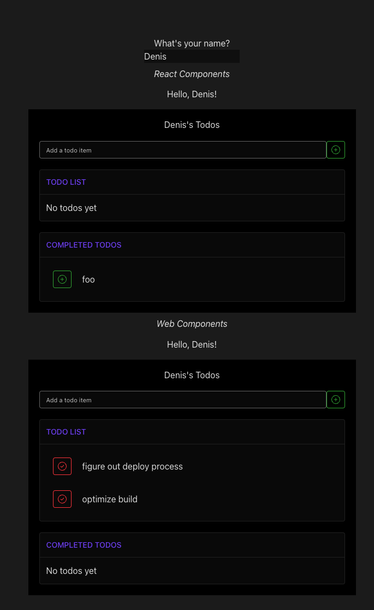

## r2wc test repo
A repo to get a feel for creating and using web components with React & r2wc

After cloning the repo and installing packages, start up the app (`npm run dev`) to see:



The app has an input field tied to some state, and that state is passed to a `UserGreeting` & `Todos` react components, 
along with the same `UserGreeting` & `Todos` as web components (using r2wc).

Building the app (`npm run build`) will create a `dist` folder which includes `dv01-web-components.es.js`, `dv01-web-components.umd.js`, 
`dv01-web-components.css`, and `dv01-web-components.d.ts` (to avoid TS errors by adding the custom elements to JSX.IntrinsicElements) files.
The `dist` folder can be copy/pasted into another vite app (in the future added via cdn or npm package) to use the web components, 
as long as the necessary files are imported. 
e.g.:
```jsx
import React from 'react';
import '../../dist/dv01-web-components.umd.js'
import '../../dist/dv01-web-components.d.ts'
import '../../dist/dv01-web-components.css'

export const WebComponentWrapper = ()=>{
  const [name, setName] = React.useState('')
  return (
    <div>
      <br/>
      <input placeholder="What's your name?" value={name} onChange={(e)=>setName(e.target.value)}/>
      <br />
      <dv01-user-greeting name={name}></dv01-user-greeting>
      <dv01-todos  name={name}></dv01-todos >
    </div>
  )
}
```

Note: Be sure to check out comments in `App.tsx`, `vite.config.ts`, and `defineCustomElements.ts` for more info.


### Issues
- styles - ~~whether css modules or waterfall components, styles are not being applied to the web components. Changing the `r2wc` `shadow` option to `false` does not help.~~ 
    - **Update**: not using the `shadow` option when defining custom elements in `defineCustomElements.ts` allowed the web component to pickup tailwind/waterfall styles from the parent app.
- vite.config.ts - there is more than likely **a lot** of room for improvement in the vite config file. I'm new to configuring this file, so I'm sure there are better ways to do things.
- r2wc props - r2wc should convert camelCase props to kebab case, but when I tried using a camelCase props (e.g. `userName`), the web component was not reactive to changes in state.  Changing the prop to just `name` resolved the issue.


### Links
- [r2wc api docs](https://github.com/bitovi/react-to-web-component/blob/main/docs/api.md)
- [r2wc issue addressing styles](https://github.com/bitovi/react-to-web-component/issues/147#issuecomment-1818009509)
- [using web components in react](https://css-tricks.com/3-approaches-to-integrate-react-with-custom-elements/)
